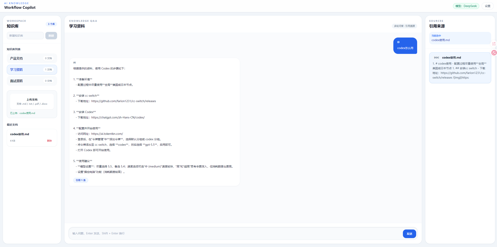

# AI Knowledge Workflow Copilot

一个面向个人知识库的 AI 问答系统。用户可以创建知识库、上传文档，并基于文档内容向 AI 提问。系统会先解析并切分文档内容，再通过 LangChain 组织 RAG 问答链路，调用 DeepSeek 生成流式回答，同时展示引用来源。

## 在线演示

- **前端 Demo**：https://ai-knowledge-workflow-copilot.vercel.app/

- **后端健康检查**：https://ai-knowledge-workflow-copilot-api.onrender.com/health



> 说明：后端部署在 Render 免费实例上，可能存在冷启动或网络访问不稳定。项目已实现前端 Demo Mode 兜底机制：当后端不可用或请求超时时，前端会自动切换到演示模式，使用本地模拟数据展示知识库、文档、问答和引用来源流程。

## 项目亮点

- **知识库管理**：支持创建多个知识库，并统计每个知识库下的文档数量。
- **文档上传解析**：支持 `.txt`、`.md`、`.pdf`、`.docx` 文档上传与文本抽取。
- **LangChain RAG 链路**：使用 ChatPromptTemplate + ChatDeepSeek 组织模型调用，并通过 TextSplitter 对文档进行切片后构建上下文。
- **流式问答体验**：后端基于 StreamingResponse 返回分段内容，前端使用 fetch reader 实时追加 AI 回答。
- **多轮对话**：前端保留最近对话历史，后端组合历史问题与文档上下文生成回答。
- **来源引用**：回答时返回相关文档来源，方便用户追溯答案依据。
- **Demo Mode 兜底**：当线上后端冷启动、超时或不可用时，前端自动切换到演示模式，保证作品集稳定展示。
- **本地持久化**：知识库和文档数据使用 JSON 文件保存，便于快速演示和部署 MVP。
- **现代化 UI**：React + Tailwind CSS 实现三栏工作台布局，文档删除使用组件化确认弹窗。

## 技术栈

### Frontend

- React
- TypeScript
- Vite
- Tailwind CSS
- Axios
- Radix UI Alert Dialog

### Backend

- Python
- FastAPI
- Pydantic
- LangChain
- DeepSeek API
- StreamingResponse
- pypdf
- python-docx

## 项目结构

```text
AI Knowledge/
├── backend/
│   ├── routers/                 # API 路由
│   ├── services/                # 业务逻辑
│   ├── main.py                  # FastAPI 入口
│   ├── schemas.py               # 数据模型
│   ├── requirements.txt         # 后端依赖
│   └── .env.example             # 后端环境变量示例
├── fronted/
│   └── ai-knowledge-workflow-copilot/
│       ├── src/
│       │   ├── components/      # 页面组件
│       │   ├── hooks/           # 业务 hooks
│       │   ├── lib/             # API 请求封装、Demo Mode 兜底
│       │   └── pages/           # 页面入口
│       ├── package.json
│       └── .env.example         # 前端环境变量示例
└── .gitignore
```

## 核心功能

### 1. 知识库

- 创建知识库
- 切换当前知识库
- 展示知识库文档数量

### 2. 文档管理

- 上传文档
- 自动解析文档内容
- 查看当前知识库文档列表
- 删除文档并同步刷新文档数量

### 3. AI 问答

- 基于当前知识库提问
- 使用 LangChain TextSplitter 对文档进行切片
- 根据用户问题检索相关文档片段并构建上下文
- 通过 LangChain ChatPromptTemplate + ChatDeepSeek 生成回答
- 支持流式输出，回答内容实时展示
- 结合历史对话生成多轮回答
- 展示答案来源文档

### 4. 演示兜底

- 后端正常时，请求真实 FastAPI 服务
- 后端异常或超时时，自动进入前端 Demo Mode
- Demo Mode 下可模拟知识库、文档、上传、删除、AI 回答和引用来源
- 顶部会显示「演示模式」标签，便于区分真实后端和演示数据

## 本地运行

### 1. 启动后端

```bash
cd backend
python -m venv .venv
.venv\Scripts\activate
pip install -r requirements.txt
```

设置 DeepSeek API Key：

```bash
# Windows PowerShell
$env:DEEPSEEK_API_KEY="your_deepseek_api_key_here"
```

启动服务：

```bash
uvicorn main:app --reload
```

后端默认运行在：

```text
http://127.0.0.1:8000
```

健康检查：

```text
http://127.0.0.1:8000/health
```

### 2. 启动前端

```bash
cd fronted/ai-knowledge-workflow-copilot
npm install
```

创建 `.env`：

```bash
VITE_API_BASE_URL=http://127.0.0.1:8000
```

启动前端：

```bash
npm run dev
```

前端默认运行在：

```text
http://localhost:5173
```

## 环境变量

### Backend

| 变量名 | 说明 |
| --- | --- |
| `DEEPSEEK_API_KEY` | DeepSeek API Key |

### Frontend

| 变量名 | 说明 |
| --- | --- |
| `VITE_API_BASE_URL` | 后端 API 地址 |

## API 简览

| 方法 | 路径 | 说明 |
| --- | --- | --- |
| `GET` | `/health` | 健康检查 |
| `GET` | `/api/knowledge-bases` | 获取知识库列表 |
| `POST` | `/api/knowledge-bases` | 创建知识库 |
| `GET` | `/api/knowledge-bases/{knowledge_base_id}/documents` | 获取知识库文档列表 |
| `POST` | `/api/documents/upload` | 上传文档 |
| `DELETE` | `/api/documents/{knowledge_base_id}/{document_id}` | 删除文档 |
| `POST` | `/api/chat` | 基于知识库问答 |

## 构建

前端生产构建：

```bash
cd fronted/ai-knowledge-workflow-copilot
npm run build
```

## 部署说明

当前项目已完成前后端分离部署：

- 前端部署在 Vercel：`https://ai-knowledge-workflow-copilot.vercel.app/`
- 后端部署在 Render：`https://ai-knowledge-workflow-copilot-api.onrender.com`
- 后端部署时需要配置环境变量 `DEEPSEEK_API_KEY`
- 前端部署时需要配置环境变量 `VITE_API_BASE_URL` 为线上后端地址

Render 免费实例可能冷启动，首次访问可能较慢。为保证在线作品集稳定可访问，前端提供 Demo Mode 兜底：当后端请求失败或超时时，自动使用本地模拟数据完成主要交互展示。

## 简历描述参考

> 开发 AI Knowledge Workflow Copilot，一个基于 React + FastAPI + DeepSeek 的个人知识库问答系统。项目支持多知识库管理、文档上传解析、基于文档内容的 RAG 问答、多轮对话历史和答案来源追溯。前端使用 React、TypeScript、Tailwind CSS 构建工作台式交互界面，后端使用 FastAPI 封装知识库、文档管理和 AI 问答 API，并通过 OpenAI SDK 接入 DeepSeek 模型。同时实现在线 Demo Mode 兜底机制，在后端冷启动或不可用时自动切换为前端模拟数据，保证作品集演示稳定可访问。

## 注意事项

- 不要把真实 API Key 提交到 GitHub。
- `backend/uploads/`、`backend/documents.json`、`backend/knowledge_bases.json` 是本地运行数据，已在 `.gitignore` 中忽略。
- 当前版本使用 JSON 文件做轻量持久化，适合作为 MVP 和在线演示。后续可以升级为 MySQL / PostgreSQL / SQLite。
- 线上 Demo 会优先请求真实后端；如果后端不可用，前端会自动切换到 Demo Mode。
